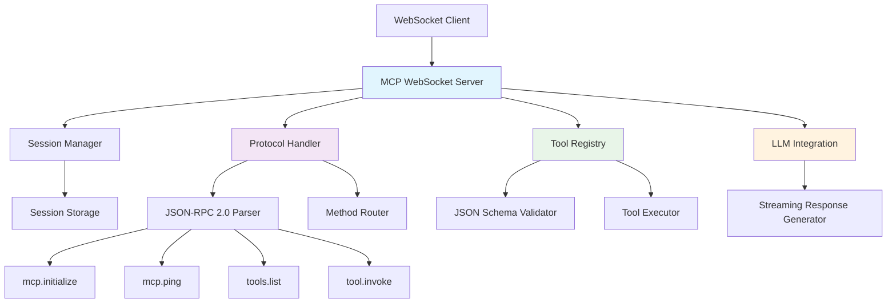
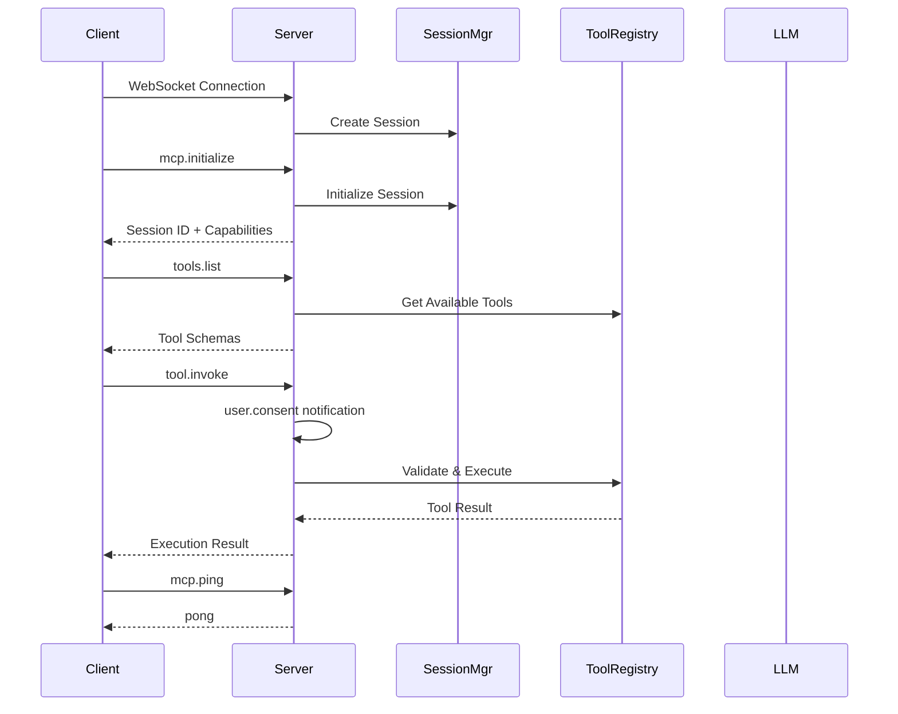
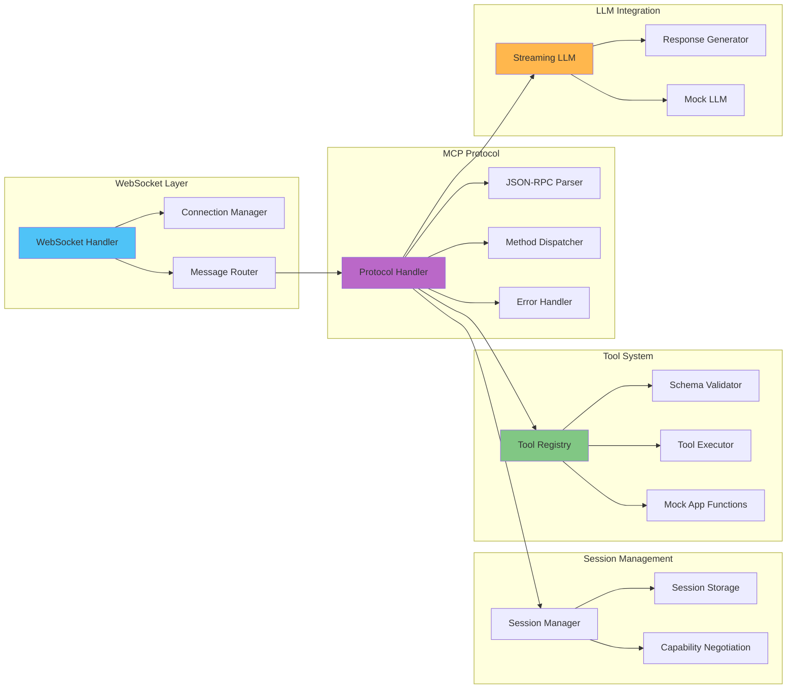

# MCP-Compliant WebSocket Server with Intelligent Function Calling

[](https://github.com/nobody-qwert/mcp_demo/actions/workflows/test-mcp-server.yml)

**Version 2.0.1** - A fully MCP (Model Context Protocol) compliant WebSocket server implementing JSON-RPC 2.0. The server combines language model integration with proper MCP protocol implementation for real-time bidirectional communication.

## 🚀 Features

- **Full MCP Compliance**: JSON-RPC 2.0 over WebSockets with proper protocol implementation
- **Session Management**: Stateful connections with unique session IDs and capability negotiation
- **Tool Registry**: JSON Schema-validated tools with automatic parameter validation
- **Language Model Integration**: Streaming LLM responses with DistilGPT-2 or mock LLM for testing
- **Real-time Communication**: WebSocket-based bidirectional messaging with progress notifications
- **Security & Consent**: Built-in user consent mechanisms for tool execution
- **Comprehensive Error Handling**: MCP-compliant error codes and detailed error responses

## 🏗️ Architecture

### MCP Protocol Overview



### MCP Protocol Flow



### Component Architecture



## 📋 Prerequisites

- **Windows 11**
- [Python 3.10+](https://www.python.org/downloads/windows/)
- [pip](https://pip.pypa.io/en/stable/installation/)
- [git](https://git-scm.com/download/win) (optional, for version control)

## 🛠️ Setup Instructions

1. **Clone or download this repository**

2. **Open a terminal in the project directory**  
   ```cmd
   cd c:\path\to\mcp_demo
   ```

3. **Create a virtual environment:**
   ```cmd
   python -m venv venv
   ```

4. **Activate the virtual environment:**
   ```cmd
   venv\Scripts\activate
   ```

5. **Install dependencies:**
   ```cmd
   pip install -r requirements.txt
   ```

6. **Run the MCP server:**
   ```cmd
   python mcp_server.py
   ```
   
   **Options:**
   - `--host HOST`: Host to bind to (default: localhost)
   - `--port PORT`: Port to bind to (default: 8080)
   - `--mock-llm`: Use mock LLM for faster testing

   The server will start on `ws://localhost:8080`.

## 🧪 Testing the MCP Server

### Automated WebSocket Test

Run the comprehensive WebSocket test client:

```cmd
python test_mcp_websocket.py
```

This test suite validates:
- ✅ Session initialization with capability negotiation
- ✅ Heartbeat mechanism (ping/pong)
- ✅ Tool discovery and schema validation
- ✅ Tool execution with parameter validation
- ✅ User consent workflow
- ✅ Error handling and edge cases

### Expected Test Results

The test client will perform a complete MCP protocol validation:

```
=== Test 1: Initialize Session ===
Session initialized: 78b56cd1-1aa7-47a9-b077-6b23de200449

=== Test 2: Ping ===
Ping successful with pong response

=== Test 3: List Tools ===
Available tools: ['create_user', 'get_user']

=== Test 4: Create User ===
Tool 'create_user' executed successfully
Result: {'user_id': 'test123', 'name': 'Test User'}

=== Test 5: Get User ===
Tool 'get_user' executed successfully
Result: {'user_id': 'test123', 'name': 'Test User'}

=== Test 6: Error Handling ===
Error response properly handled for invalid tool

=== All Tests Passed! ===
```

## 🔌 MCP Protocol Methods

### Core Protocol Methods

#### `mcp.initialize`
Initialize a new MCP session with capability negotiation.

**Request:**
```json
{
  "jsonrpc": "2.0",
  "method": "mcp.initialize",
  "params": {
    "protocolVersion": "2024-11-05",
    "capabilities": {"tools": true, "streaming": true},
    "clientInfo": {"name": "MCP Client", "version": "1.0.0"}
  },
  "id": "req-1"
}
```

**Response:**
```json
{
  "jsonrpc": "2.0",
  "result": {
    "protocolVersion": "2024-11-05",
    "sessionId": "78b56cd1-1aa7-47a9-b077-6b23de200449",
    "capabilities": {"tools": true, "streaming": true, "progress": true, "consent": true},
    "serverInfo": {"name": "MCP Demo Server", "version": "1.0.0"}
  },
  "id": "req-1"
}
```

#### `mcp.ping`
Heartbeat mechanism to keep connections alive.

**Request:**
```json
{
  "jsonrpc": "2.0",
  "method": "mcp.ping",
  "params": {"timestamp": 1640995200000},
  "id": "req-2"
}
```

#### `tools.list`
List all available tools with their JSON schemas.

**Response:**
```json
{
  "jsonrpc": "2.0",
  "result": {
    "tools": [
      {
        "name": "create_user",
        "description": "Create a new user in the system with a unique ID and name",
        "inputSchema": {
          "type": "object",
          "properties": {
            "user_id": {"type": "string", "description": "Unique user identifier"},
            "name": {"type": "string", "description": "User's display name"}
          },
          "required": ["user_id", "name"]
        }
      }
    ]
  },
  "id": "req-3"
}
```

#### `tool.invoke`
Execute a tool with validated parameters.

**Request:**
```json
{
  "jsonrpc": "2.0",
  "method": "tool.invoke",
  "params": {
    "name": "create_user",
    "arguments": {"user_id": "123", "name": "Alice"}
  },
  "id": "req-4"
}
```

### Notifications

#### `user.consent`
Request user consent before tool execution.

```json
{
  "jsonrpc": "2.0",
  "method": "user.consent",
  "params": {
    "tool": "create_user",
    "arguments": {"user_id": "123", "name": "Alice"},
    "message": "Do you want to execute tool 'create_user' with the provided arguments?"
  }
}
```

#### `tool.progress`
Progress updates for long-running operations.

```json
{
  "jsonrpc": "2.0",
  "method": "tool.progress",
  "params": {
    "requestId": "req-4",
    "progress": 0.5,
    "message": "Processing user creation..."
  }
}
```

## 📁 Project Structure

```
mcp_demo/
├── mcp_server.py              # Main MCP server entry point
├── websocket_handler.py       # WebSocket server implementation
├── mcp_protocol.py           # MCP protocol handler with JSON-RPC 2.0
├── session_manager.py        # Session management and lifecycle
├── tool_registry.py          # MCP tool registry with JSON Schema
├── llm_integration.py        # Streaming LLM integration
├── dummy_app.py             # Mock user management application
├── test_mcp_websocket.py    # WebSocket test client
├── requirements.txt         # Python dependencies
├── VERSION                  # Version information
├── CHANGELOG.md            # Release notes and version history
├── README.md               # This file
├── .gitignore              # Git configuration
└── venv/                   # Virtual environment (created during setup)
```

## 🔧 How It Works

### 1. WebSocket Connection & Session Management
- Client connects via WebSocket to `ws://localhost:8080`
- Server creates unique session with UUID
- Capability negotiation during `mcp.initialize`

### 2. Tool Discovery & Schema Validation
- Tools registered with JSON Schema definitions
- Client discovers tools via `tools.list`
- Parameters validated against schemas before execution

### 3. Secure Tool Execution
- User consent requested via `user.consent` notification
- Parameters validated against JSON Schema
- Tools executed in isolated environment
- Results returned with success/error status

### 4. Real-time Communication
- Bidirectional WebSocket messaging
- Progress notifications for long operations
- Streaming LLM responses (when enabled)
- Heartbeat mechanism for connection health

## 🚨 Troubleshooting

**WebSocket Connection Issues:**
- Ensure server is running: `python mcp_server.py --mock-llm`
- Check port availability: Default port 8080
- Verify firewall settings

**Tool Execution Errors:**
- Check JSON Schema validation in logs
- Verify tool parameters match schema requirements
- Review consent mechanism responses

**Session Management:**
- Sessions auto-expire on disconnect
- Use `mcp.ping` for keepalive
- Check session logs for debugging

**LLM Integration:**
- Use `--mock-llm` flag for testing without model loading
- First run downloads DistilGPT-2 model (~500MB)
- Requires internet connection for initial setup

**General Issues:**
- Check that all dependencies are installed: `pip list`
- Verify Python version: `python --version`
- Review server logs for detailed error information

## 🎯 MCP Compliance Features

- ✅ **JSON-RPC 2.0**: Full specification compliance
- ✅ **WebSocket Transport**: Stateful bidirectional communication
- ✅ **Session Management**: Unique session IDs and lifecycle management
- ✅ **Capability Negotiation**: Protocol version and feature discovery
- ✅ **Tool Registry**: JSON Schema-based tool definitions
- ✅ **Parameter Validation**: Automatic schema validation
- ✅ **Error Handling**: MCP-compliant error codes and messages
- ✅ **Security**: User consent mechanisms
- ✅ **Progress Notifications**: Real-time operation updates
- ✅ **Heartbeat**: Connection health monitoring
- ✅ **Streaming**: Partial response streaming support

## 🔄 Migration from HTTP to WebSocket

The server maintains backward compatibility concepts while implementing full MCP compliance:

- **Legacy HTTP endpoints** → **WebSocket JSON-RPC methods**
- **Custom function detection** → **JSON Schema tool definitions**
- **REST API calls** → **Real-time WebSocket communication**
- **Simple responses** → **Structured MCP protocol messages**

## 📈 Version History

This project follows [Semantic Versioning](https://semver.org/). See [CHANGELOG.md](CHANGELOG.md) for detailed release notes.

### Current Version: 2.0.1
- **v2.0.1** (2025-05-24): Cleanup release - removed legacy files and updated documentation
- **v2.0.0** (2025-05-24): Full MCP protocol compliance with WebSocket JSON-RPC 2.0
- **v1.0.0** (2025-05-24): Initial HTTP REST API with intelligent function calling

### Git Tags
- `v2.0.1`: Cleanup release with legacy file removal
- `v2.0.0`: Complete MCP-compliant WebSocket server
- `v1.0.0`: Legacy HTTP REST API version

## 📄 License

This is a demo project for educational purposes demonstrating MCP server architecture and protocol implementation patterns.
