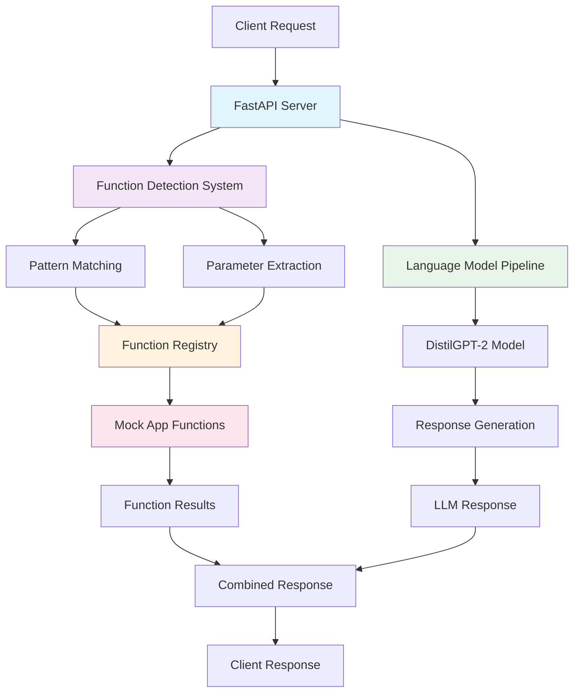
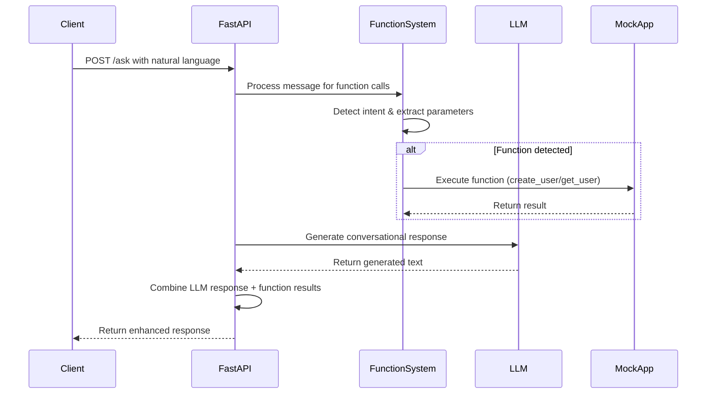
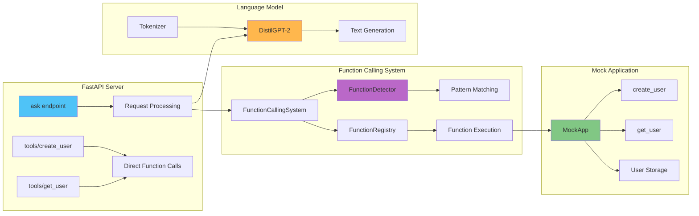

# MCP Demo Server with Intelligent Function Calling

A FastAPI-based Model Context Protocol (MCP) demo server that combines language model capabilities with intelligent function calling. The server can automatically detect user intents from natural language requests and execute appropriate functions while providing conversational responses.

## 🚀 Features

- **Intelligent Function Calling**: Automatically detects when users want to perform actions (create/get users) from natural language
- **Language Model Integration**: Uses Hugging Face transformers (DistilGPT-2) for conversational responses
- **Mock User Management**: Demonstrates function calling with user creation and retrieval operations
- **Hybrid Response System**: Combines LLM responses with function execution results
- **Comprehensive Logging**: Tracks all function calls and operations for debugging

## 🏗️ Architecture

### System Overview



### Function Calling Flow



### Component Architecture



## 📋 Prerequisites

- **Windows 11**
- [Python 3.10+](https://www.python.org/downloads/windows/)
- [pip](https://pip.pypa.io/en/stable/installation/)
- [git](https://git-scm.com/download/win) (optional, for version control)

## 🛠️ Setup Instructions

1. **Clone or download this repository**

2. **Open a terminal in the project directory**  
   ```cmd
   cd c:\path\to\mcp_demo
   ```

3. **Create a virtual environment:**
   ```cmd
   python -m venv venv
   ```

4. **Activate the virtual environment:**
   ```cmd
   venv\Scripts\activate
   ```

5. **Install dependencies:**
   ```cmd
   pip install -r requirements.txt
   ```

6. **Run the server:**
   ```cmd
   python mcp_server.py
   ```
   The server will start on [http://localhost:8080](http://localhost:8080).

## 🧪 Testing the System

### Automated Test Script

Run the PowerShell test script to see intelligent function calling in action:

```powershell
.\test_mcp.ps1
```

This script sends a natural language request: *"Please create a new user with id 2 and name Alice."*

### Expected Test Results

The system will:

1. **Detect Intent**: Recognize the user wants to create a user
2. **Extract Parameters**: Parse `user_id=2` and `name=Alice`
3. **Execute Function**: Call `create_user(user_id="2", name="alice")`
4. **Generate Response**: Provide both LLM response and function results

**Sample Response:**
```json
{
  "choices": [
    {
      "message": {
        "role": "assistant",
        "content": "Please create a new user with id 2 and name Alice.\n\n--- Function Execution Results ---\n✅ create_user(user_id=2, name=alice)\n   Result: {'user_id': '2', 'name': 'alice'}\n"
      }
    }
  ],
  "function_calls": [
    {
      "function": "create_user",
      "parameters": {"user_id": "2", "name": "alice"},
      "result": {"user_id": "2", "name": "alice"},
      "success": true,
      "error": null
    }
  ]
}
```

### Manual Testing Examples

You can test various natural language patterns:

**Create User Examples:**
- `"Create a new user with id 123 and name John"`
- `"Add user with ID 456 and name Sarah"`
- `"Make a user: id=789, name=Mike"`

**Get User Examples:**
- `"Get user with id 123"`
- `"Find user ID 456"`
- `"Retrieve user with id 789"`

## 🔌 API Endpoints

### POST `/ask` - Intelligent Function Calling
Send natural language requests that can trigger function execution.

**Request Body:**
```json
{
  "messages": [
    {"role": "user", "content": "Create a new user with id 123 and name John"}
  ]
}
```

**Response:**
```json
{
  "choices": [{"message": {"role": "assistant", "content": "..."}}],
  "function_calls": [...]
}
```

### POST `/tools/create_user` - Direct User Creation
Create a user via direct API call.

**Request Body:**
```json
{
  "user_id": "123",
  "name": "Alice"
}
```

### POST `/tools/get_user` - Direct User Retrieval
Retrieve a user via direct API call.

**Request Body:**
```json
{
  "user_id": "123"
}
```

## 📁 Project Structure

```
mcp_demo/
├── mcp_server.py           # Main FastAPI server
├── function_calling.py     # Intelligent function calling system
├── dummy_app.py           # Mock user management application
├── test_mcp.ps1           # PowerShell test script
├── requirements.txt       # Python dependencies
├── README.md             # This file
└── venv/                 # Virtual environment (created during setup)
```

## 🔧 How It Works

### 1. Intent Detection
The `FunctionDetector` class uses regex patterns to identify user intents:
- **Create User**: Patterns like "create user", "add user", "new user"
- **Get User**: Patterns like "get user", "find user", "retrieve user"

### 2. Parameter Extraction
Natural language parsing extracts function parameters:
- User ID from patterns like "id 123", "ID: 456"
- Names from patterns like "name Alice", "name: John"

### 3. Function Execution
The `FunctionRegistry` safely executes detected functions with extracted parameters.

### 4. Response Combination
Results are combined into a comprehensive response containing:
- Original LLM conversational response
- Function execution results
- Success/error status for each function call

## 🚨 Troubleshooting

**Virtual Environment Issues:**
- Ensure you're running commands from the activated virtual environment
- Use `venv\Scripts\python.exe` if activation fails

**Model Loading:**
- First run downloads DistilGPT-2 model (~500MB)
- Requires internet connection for initial setup

**Function Detection:**
- Check logs for intent detection: `INFO:function_calling:Detected create_user`
- Verify parameter extraction in server logs

**General Issues:**
- Check that all dependencies are installed: `pip list`
- Verify Python version: `python --version`
- Ensure port 8080 is available

## 🎯 Future Enhancements

- [ ] Add more sophisticated NLP for intent detection
- [ ] Implement user authentication and authorization
- [ ] Add database persistence instead of in-memory storage
- [ ] Support for more complex function parameters
- [ ] Integration with larger language models
- [ ] Web-based testing interface

## 📄 License

This is a demo project for educational purposes demonstrating MCP server architecture and intelligent function calling patterns.
